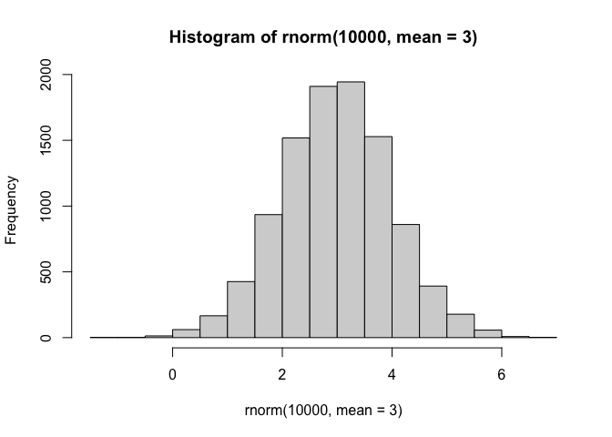
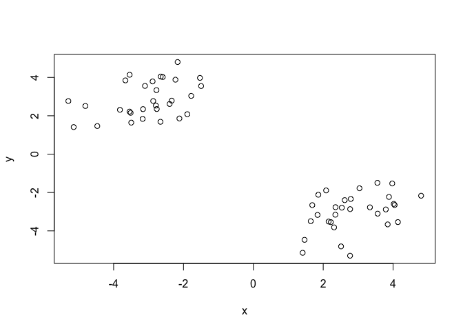
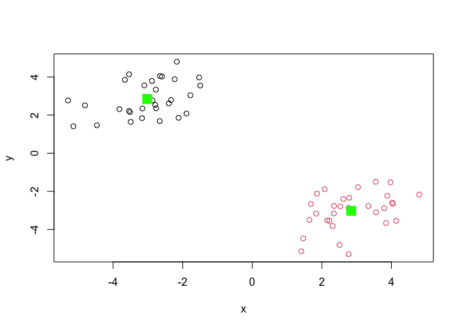
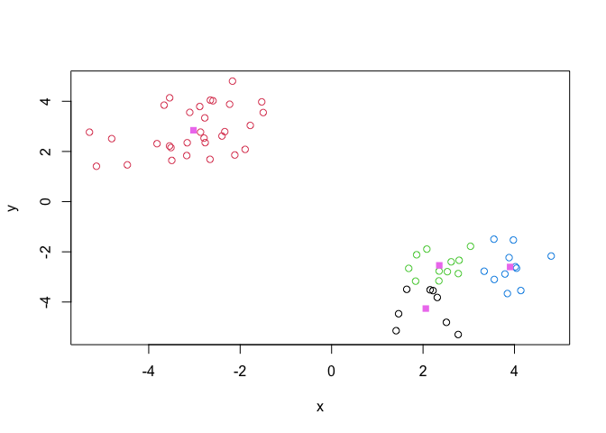
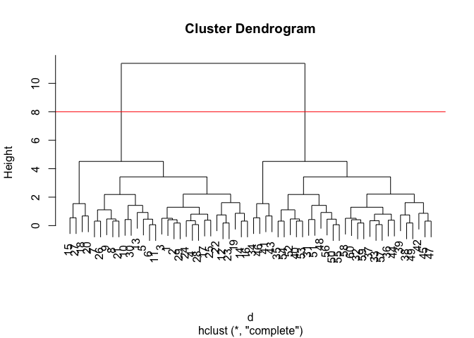
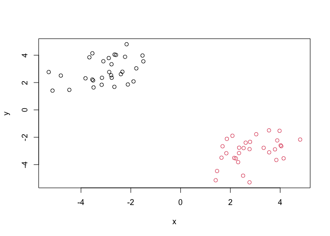
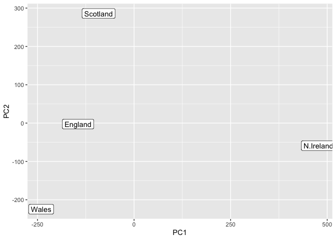

# Class 07- Machine Learning
Renee Zuhars (PID: A17329856)

- [Clustering](#clustering)
  - [K-means](#k-means)
  - [Hierarchical Clustering](#hierarchical-clustering)
- [Principal Component Analysis
  (PCA)](#principal-component-analysis-pca)
  - [Data import](#data-import)
  - [PCA to the rescue](#pca-to-the-rescue)

Today we will explore unsupervised machine learning methods starting
with clustering and dimensionality reduction.

## Clustering

To start let’s make up some data to cluster where we know what the
answer should be. The `rnorm()` function will help us here.

``` r
hist( rnorm(10000, mean=3) )
```



Return 30 numbers (a vector of 30 elements) centered on -3. Then do the
same with positive 3.

``` r
tmp <- c( rnorm(30, mean=-3), 
        rnorm(30, mean=3) )

x <- cbind(x=tmp, y=rev(tmp))

x
```

                  x         y
     [1,] -3.158180  2.347042
     [2,] -2.765296  2.351925
     [3,] -2.866894  2.770553
     [4,] -3.514009  2.154776
     [5,] -2.230322  3.882076
     [6,] -2.594002  4.020195
     [7,] -3.662783  3.845401
     [8,] -3.102505  3.557755
     [9,] -2.773974  3.337197
    [10,] -1.528550  3.975580
    [11,] -2.651859  4.044920
    [12,] -2.337219  2.789233
    [13,] -2.167970  4.802378
    [14,] -2.117163  1.859566
    [15,] -4.809708  2.510610
    [16,] -1.891114  2.083066
    [17,] -3.168912  1.837352
    [18,] -4.468004  1.465333
    [19,] -2.659256  1.686662
    [20,] -5.143332  1.411180
    [21,] -2.884241  3.791455
    [22,] -1.778771  3.038270
    [23,] -2.398128  2.615369
    [24,] -3.818763  2.311160
    [25,] -3.495016  1.643218
    [26,] -3.542133  4.138507
    [27,] -5.296311  2.768626
    [28,] -3.544518  2.218234
    [29,] -2.790219  2.531692
    [30,] -1.495571  3.550990
    [31,]  3.550990 -1.495571
    [32,]  2.531692 -2.790219
    [33,]  2.218234 -3.544518
    [34,]  2.768626 -5.296311
    [35,]  4.138507 -3.542133
    [36,]  1.643218 -3.495016
    [37,]  2.311160 -3.818763
    [38,]  2.615369 -2.398128
    [39,]  3.038270 -1.778771
    [40,]  3.791455 -2.884241
    [41,]  1.411180 -5.143332
    [42,]  1.686662 -2.659256
    [43,]  1.465333 -4.468004
    [44,]  1.837352 -3.168912
    [45,]  2.083066 -1.891114
    [46,]  2.510610 -4.809708
    [47,]  1.859566 -2.117163
    [48,]  4.802378 -2.167970
    [49,]  2.789233 -2.337219
    [50,]  4.044920 -2.651859
    [51,]  3.975580 -1.528550
    [52,]  3.337197 -2.773974
    [53,]  3.557755 -3.102505
    [54,]  3.845401 -3.662783
    [55,]  4.020195 -2.594002
    [56,]  3.882076 -2.230322
    [57,]  2.154776 -3.514009
    [58,]  2.770553 -2.866894
    [59,]  2.351925 -2.765296
    [60,]  2.347042 -3.158180

Make a plot of `x`.

``` r
plot(x)
```



### K-means

The main function in “base” R for K-means clustering is called
`kmeans()`.

``` r
km <- kmeans(x, centers=2)
km
```

    K-means clustering with 2 clusters of sizes 30, 30

    Cluster means:
              x         y
    1 -3.021824  2.844677
    2  2.844677 -3.021824

    Clustering vector:
     [1] 1 1 1 1 1 1 1 1 1 1 1 1 1 1 1 1 1 1 1 1 1 1 1 1 1 1 1 1 1 1 2 2 2 2 2 2 2 2
    [39] 2 2 2 2 2 2 2 2 2 2 2 2 2 2 2 2 2 2 2 2 2 2

    Within cluster sum of squares by cluster:
    [1] 53.25121 53.25121
     (between_SS / total_SS =  90.6 %)

    Available components:

    [1] "cluster"      "centers"      "totss"        "withinss"     "tot.withinss"
    [6] "betweenss"    "size"         "iter"         "ifault"      

The `kmeans()` function return “list” with 9 components.

``` r
attributes(km)
```

    $names
    [1] "cluster"      "centers"      "totss"        "withinss"     "tot.withinss"
    [6] "betweenss"    "size"         "iter"         "ifault"      

    $class
    [1] "kmeans"

> Q. How many points are in each cluster?

``` r
km$size
```

    [1] 30 30

> Q. Cluster assignment/membership vector?

``` r
km$cluster
```

     [1] 1 1 1 1 1 1 1 1 1 1 1 1 1 1 1 1 1 1 1 1 1 1 1 1 1 1 1 1 1 1 2 2 2 2 2 2 2 2
    [39] 2 2 2 2 2 2 2 2 2 2 2 2 2 2 2 2 2 2 2 2 2 2

> Q. Cluster centers?

``` r
km$centers
```

              x         y
    1 -3.021824  2.844677
    2  2.844677 -3.021824

> Q. Make a plot of our `kmeans()` results showing cluster assignment
> using different colors for each cluster/group of points and cluster
> centers.

``` r
plot(x, col=km$cluster) #color by cluster
points(km$centers, col="green", pch=15, cex=2)
```



> Q. Run `kmeans` again on `x` and create 4 groups/clusters. Plot the
> same result figure as above.

``` r
km4 <- kmeans(x, centers=4)
plot(x, col=km4$cluster)
points(km4$centers, col="violet", pch=15)
```



> **key point**: K means clustering is super popular but can be misused.
> One big limitation is that it can impose a clustering pattern on your
> data even if clear natural grouping doesn’t exist- i.e. it does what
> you tell it to do in terms of `centers`.

### Hierarchical Clustering

The main function in “base” R for hierarchical clustering is called
`hclust()`

You can’t just pass our dataset as is into `hclust()` you must give
“distance matrix” as input. We can get this from the `dist()` function
in R.

``` r
d <- dist(x)
hc <- hclust(d)
hc
```


    Call:
    hclust(d = d)

    Cluster method   : complete 
    Distance         : euclidean 
    Number of objects: 60 

The results of `hclust()` don’t have a useful `print()` method but do
have a special `plot()` method.

``` r
plot(hc)
abline(h=8, col='red')
```



To get our main cluster assignment (membership vector) we need to “cut”
the tree at the big goalposts

``` r
grps <- (cutree(hc, h=8))
grps
```

     [1] 1 1 1 1 1 1 1 1 1 1 1 1 1 1 1 1 1 1 1 1 1 1 1 1 1 1 1 1 1 1 2 2 2 2 2 2 2 2
    [39] 2 2 2 2 2 2 2 2 2 2 2 2 2 2 2 2 2 2 2 2 2 2

``` r
table(grps)
```

    grps
     1  2 
    30 30 

``` r
plot(x, col=grps)
```



Hierarchical Clustering is distinct in that the dendrogram (tree figure)
can reveal the potential grouping in your data

## Principal Component Analysis (PCA)

PCA is a common and highly useful dimensionality reduction technique
used in many fields- particularly bioinformatics.

Here we will analyze some data from the UK on food consumption.

### Data import

``` r
url <- 'https://tinyurl.com/UK-foods'
x <- read.csv(url)
head(x)
```

                   X England Wales Scotland N.Ireland
    1         Cheese     105   103      103        66
    2  Carcass_meat      245   227      242       267
    3    Other_meat      685   803      750       586
    4           Fish     147   160      122        93
    5 Fats_and_oils      193   235      184       209
    6         Sugars     156   175      147       139

``` r
rownames(x) <- x[,1]
x <- x[,-1] #destructive, removes each time
head(x)
```

                   England Wales Scotland N.Ireland
    Cheese             105   103      103        66
    Carcass_meat       245   227      242       267
    Other_meat         685   803      750       586
    Fish               147   160      122        93
    Fats_and_oils      193   235      184       209
    Sugars             156   175      147       139

``` r
x <- read.csv(url, row.names = 1)
head(x)
```

                   England Wales Scotland N.Ireland
    Cheese             105   103      103        66
    Carcass_meat       245   227      242       267
    Other_meat         685   803      750       586
    Fish               147   160      122        93
    Fats_and_oils      193   235      184       209
    Sugars             156   175      147       139

``` r
barplot(as.matrix(x), beside=T, col=rainbow(nrow(x)))
```


``` r
barplot(as.matrix(x), beside=F, col=rainbow(nrow(x)))
```


One conventional plot that can be useful is called a “pairs” plot (plot
of all pairwise combinations of countries next to each other)

``` r
pairs(x, col=rainbow(10), pch=16)
```


This pairwise plot produces 12 graphs directly comparing each country to
each other country.

### PCA to the rescue

The main function in base R for PCA is called `prcomp()`.

``` r
pca <- prcomp( t(x) )
summary(pca)
```

    Importance of components:
                                PC1      PC2      PC3       PC4
    Standard deviation     324.1502 212.7478 73.87622 2.921e-14
    Proportion of Variance   0.6744   0.2905  0.03503 0.000e+00
    Cumulative Proportion    0.6744   0.9650  1.00000 1.000e+00

PC1 vs PC2 results in 96.5% coverage (see cumulative proportion)

The `prcomp()` function returns a list object of our results with

``` r
attributes(pca)
```

    $names
    [1] "sdev"     "rotation" "center"   "scale"    "x"       

    $class
    [1] "prcomp"

The two main “results” in here are `pca$x` and `pca$rotation`. The first
of these (`pca$x`) contains the scores of the data on the new PC axis-
we use these to make our “PCA plot”.

``` r
pca$x
```

                     PC1         PC2        PC3           PC4
    England   -144.99315   -2.532999 105.768945 -9.152022e-15
    Wales     -240.52915 -224.646925 -56.475555  5.560040e-13
    Scotland   -91.86934  286.081786 -44.415495 -6.638419e-13
    N.Ireland  477.39164  -58.901862  -4.877895  1.329771e-13

> Q. Make a plot of pca\$x with PC1 vs PC2

``` r
library(ggplot2)

ggplot(pca$x) + 
  aes(PC1, PC2, label=rownames(pca$x)) +
  geom_point() +
  geom_label()
```



This plot shows the distribution spread of the four countries.

The second major result is contained in the `pca$rotation` object or
component. Let’s plot this to see what PCA is picking up…

``` r
pca$rotation
```

                                 PC1          PC2         PC3          PC4
    Cheese              -0.056955380  0.016012850  0.02394295 -0.409382587
    Carcass_meat         0.047927628  0.013915823  0.06367111  0.729481922
    Other_meat          -0.258916658 -0.015331138 -0.55384854  0.331001134
    Fish                -0.084414983 -0.050754947  0.03906481  0.022375878
    Fats_and_oils       -0.005193623 -0.095388656 -0.12522257  0.034512161
    Sugars              -0.037620983 -0.043021699 -0.03605745  0.024943337
    Fresh_potatoes       0.401402060 -0.715017078 -0.20668248  0.021396007
    Fresh_Veg           -0.151849942 -0.144900268  0.21382237  0.001606882
    Other_Veg           -0.243593729 -0.225450923 -0.05332841  0.031153231
    Processed_potatoes  -0.026886233  0.042850761 -0.07364902 -0.017379680
    Processed_Veg       -0.036488269 -0.045451802  0.05289191  0.021250980
    Fresh_fruit         -0.632640898 -0.177740743  0.40012865  0.227657348
    Cereals             -0.047702858 -0.212599678 -0.35884921  0.100043319
    Beverages           -0.026187756 -0.030560542 -0.04135860 -0.018382072
    Soft_drinks          0.232244140  0.555124311 -0.16942648  0.222319484
    Alcoholic_drinks    -0.463968168  0.113536523 -0.49858320 -0.273126013
    Confectionery       -0.029650201  0.005949921 -0.05232164  0.001890737

``` r
ggplot(pca$rotation) +
  aes(PC1, rownames(pca$rotation)) +
  geom_col()
```


This plot compares the PC1 to our original dataset.
