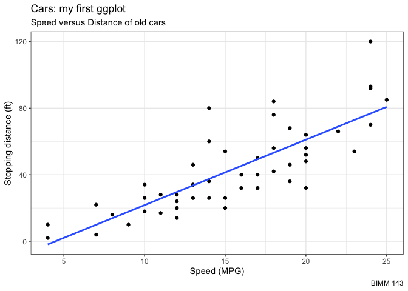
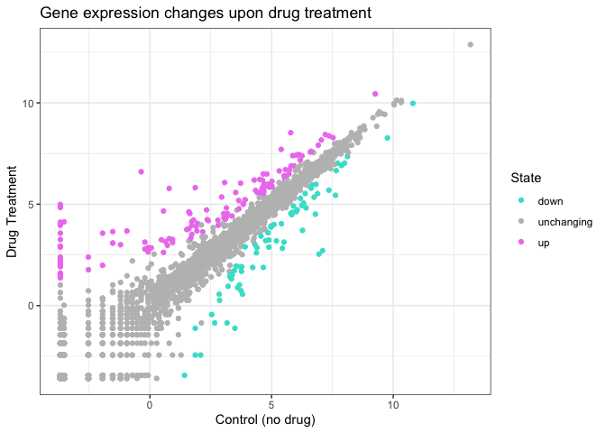
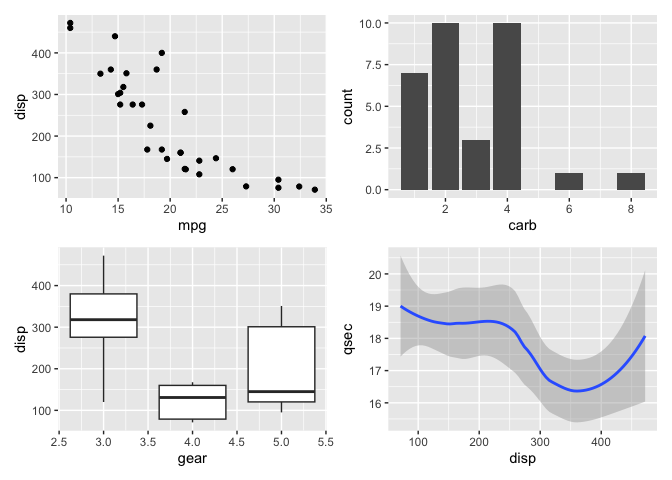
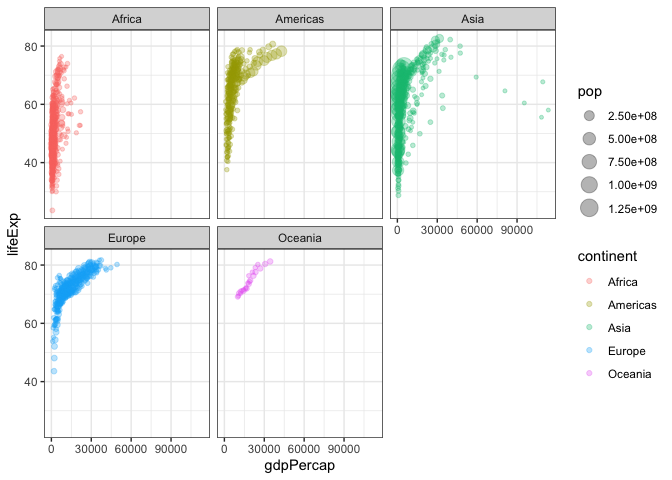

# Class05: Data Visualization with ggplot
Renee Zuhars (PID: A17329856)

- [Background: *comparing “base” and
  ggplot2*](#background-comparing-base-and-ggplot2)
  - [How can we do this with
    **ggplot2**?](#how-can-we-do-this-with-ggplot2)
  - [Gene expression plot](#gene-expression-plot)
    - [Custom color plot](#custom-color-plot)
- [Using different geoms](#using-different-geoms)
  - [Combining plots into a figure](#combining-plots-into-a-figure)
- [Faceting](#faceting)
- [Renee’s notes on Quarto- *the
  basics*](#renees-notes-on-quarto--the-basics)
  - [How to run code](#how-to-run-code)

# Background: *comparing “base” and ggplot2*

There are many graphics systems available in R. These include “base” R
and tons of add on packages, like **ggplot2**.

Let’s compare “base” and **ggplot** briefly. We can use some example
data that is built-in with R called `cars`:

``` r
head(cars)
```

      speed dist
    1     4    2
    2     4   10
    3     7    4
    4     7   22
    5     8   16
    6     9   10

In base R I can just call `plot()`

``` r
plot(cars)
```


### How can we do this with **ggplot2**?

First, we need to install the package. We do this with
`install.packages("ggplot2")`. I only need to do this once and then it
will be available on my computer so I don’t need to re-install it.

> Key point: I only install packages in the R console, not within quarto
> docs or R scripts.

Before I use any add on package, I must load it up with a call to
`library()`

``` r
library(ggplot2)
ggplot(cars)
```


This doesn’t yield a very interesting plot.

Every ggplot has at least 3 things (called layers).

- the **data** (in our case, `cars`)
- the **aes**thetics (how the data map to the plot)
- the **geom**etries that determine how the plot is drawn (lines,
  points, columns, etc.)

``` r
ggplot(cars) + 
  aes(x=speed, y=dist) +
  geom_point()
```


There we go!

For “simple” plots, ggplot is much more verbose than base R, as it
involves more typing. But, the defaults are nicer and for complicated
plots it becomes much more efficient and structured.

> Q. Add a line to show the relationship of speed to stopping distance
> (i.e. add another “layer”).

``` r
p <- ggplot(cars) + 
  aes(x=speed, y=dist) +
  geom_point() +
  geom_smooth(se=FALSE, method="lm")
```

*note*: to save the plot, we assign it to “p”.

> Q. Add a title and subtitle to the plot.

I can always save any ggplot object (i.e. plot) and then use it later
for adding more layers:

``` r
p + labs(title = "Cars: my first ggplot",
         subtitle = "Speed versus Distance of old cars",
         caption = "BIMM 143",
         x = "Speed (MPG)",
         y = "Stopping distance (ft)") +
  theme_bw()
```

    `geom_smooth()` using formula = 'y ~ x'



## Gene expression plot

Read input data into R

``` r
url <- "https://bioboot.github.io/bimm143_S20/class-material/up_down_expression.txt"
genes <- read.delim(url)
head(genes)
```

            Gene Condition1 Condition2      State
    1      A4GNT -3.6808610 -3.4401355 unchanging
    2       AAAS  4.5479580  4.3864126 unchanging
    3      AASDH  3.7190695  3.4787276 unchanging
    4       AATF  5.0784720  5.0151916 unchanging
    5       AATK  0.4711421  0.5598642 unchanging
    6 AB015752.4 -3.6808610 -3.5921390 unchanging

> Q. How many genes are in this wee database?

``` r
nrow(genes)
```

    [1] 5196

> Q. How many columns are there?

``` r
ncol(genes)
```

    [1] 4

> Q. What are the column names?

``` r
colnames(genes)
```

    [1] "Gene"       "Condition1" "Condition2" "State"     

> Q. How many “up” and “down” regulated genes are there?

``` r
table(genes$"State")
```


          down unchanging         up 
            72       4997        127 

### Custom color plot

> Q. Make a first plot of this data

``` r
ggplot(genes) +
  aes(x=Condition1, y=Condition2, col=State) + 
  scale_color_manual(values=c("turquoise", "gray", "violet")) + 
  geom_point() +
  labs(title="Gene expression changes upon drug treatment", x="Control (no drug)", y="Drug Treatment") + 
  theme_bw()
```



# Using different geoms

Let’s plot some aspects of the in-built `mtcars` dataset

``` r
head(mtcars)
```

                       mpg cyl disp  hp drat    wt  qsec vs am gear carb
    Mazda RX4         21.0   6  160 110 3.90 2.620 16.46  0  1    4    4
    Mazda RX4 Wag     21.0   6  160 110 3.90 2.875 17.02  0  1    4    4
    Datsun 710        22.8   4  108  93 3.85 2.320 18.61  1  1    4    1
    Hornet 4 Drive    21.4   6  258 110 3.08 3.215 19.44  1  0    3    1
    Hornet Sportabout 18.7   8  360 175 3.15 3.440 17.02  0  0    3    2
    Valiant           18.1   6  225 105 2.76 3.460 20.22  1  0    3    1

> Q. Scatter plot of `mpg` vs `disp`

``` r
p1 <- ggplot(mtcars) + 
  aes(x=mpg, y=disp) +
  geom_point() 
```

> Q. Boxplot of `gear` vs `disp`

``` r
p2 <- ggplot(mtcars) + 
  aes(x=gear, y=disp, group=gear) + 
  geom_boxplot()
```

> Q. Barplot of `carb`

``` r
p3 <- ggplot(mtcars) + 
  aes(carb) + 
  geom_bar()
```

> Q. Smooth of `disp` vs `qsec`

``` r
p4 <- ggplot(mtcars) + 
  aes(x=disp, y=qsec) +
  geom_smooth()
```

### Combining plots into a figure

I want to combine all these plots into one figure with multiple panels.

We can use the **patchwork** package to do this.

> Note: (install.packages(“patchwork”) was used to install this package
> in the R console.)

``` r
library(patchwork)

(p1 / p2 | p3 / p4)
```

    `geom_smooth()` using method = 'loess' and formula = 'y ~ x'



``` r
ggsave(filename="myplot.png", width=10, height=10)
```

    `geom_smooth()` using method = 'loess' and formula = 'y ~ x'

# Faceting

``` r
#File location online
url <- "https://raw.githubusercontent.com/jennybc/gapminder/master/inst/extdata/gapminder.tsv"

gapminder <- read.delim(url)
```

And a wee peek

``` r
head(gapminder, 10)
```

           country continent year lifeExp      pop gdpPercap
    1  Afghanistan      Asia 1952  28.801  8425333  779.4453
    2  Afghanistan      Asia 1957  30.332  9240934  820.8530
    3  Afghanistan      Asia 1962  31.997 10267083  853.1007
    4  Afghanistan      Asia 1967  34.020 11537966  836.1971
    5  Afghanistan      Asia 1972  36.088 13079460  739.9811
    6  Afghanistan      Asia 1977  38.438 14880372  786.1134
    7  Afghanistan      Asia 1982  39.854 12881816  978.0114
    8  Afghanistan      Asia 1987  40.822 13867957  852.3959
    9  Afghanistan      Asia 1992  41.674 16317921  649.3414
    10 Afghanistan      Asia 1997  41.763 22227415  635.3414

> Q. How many countries are in this dataset?

``` r
length(table(gapminder$country))
```

    [1] 142

> Q. Plot gdpPercap vs lifeExp color by continent

``` r
ggplot(gapminder) + 
  aes(x=gdpPercap, y=lifeExp, color=continent, size=pop) + 
  geom_point(alpha=0.3) +
  facet_wrap(~continent) +
  theme_bw()
```



# Renee’s notes on Quarto- *the basics*

1.  The heading above is a level two heading- preceded by two pound
    signs and a space. (A level 1 heading is larger and preceded by 1
    pound sign and a space).

2.  To put font in italics, *you surround it by two asterisks*

3.  To put font in bold, **you surround it by four asterisks**

## How to run code

You can embed code by creating code chunks:

``` r
"code chunk" <- (1:10)
```

To create a chunk, you can add *three back-ticks* (\`\`\`), then the
type of code you are using *in mustache brackets* ({}).

OR you can hit option + command + i (for mac)
