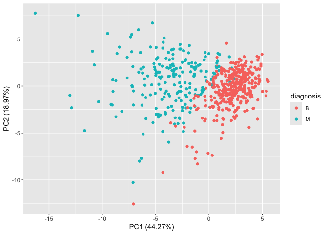
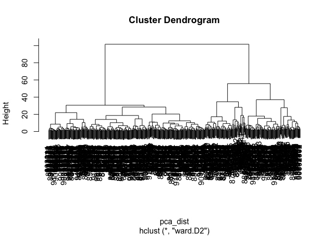

# Class 08 Lab
Renee Zuhars (PID: A17329856)

- [1. Exploratory Data Analysis](#1-exploratory-data-analysis)
  - [Question 1](#question-1)
  - [Question 2](#question-2)
  - [Question 3](#question-3)
- [2. Principal Component Analysis](#2-principal-component-analysis)
  - [Question 4](#question-4)
  - [Question 5](#question-5)
  - [Question 6](#question-6)
  - [Question 7](#question-7)
  - [Question 8](#question-8)
  - [Question 9](#question-9)
  - [Question 10](#question-10)
- [3. Hierarchical Clustering](#3-hierarchical-clustering)
  - [Question 11](#question-11)
  - [Question 12](#question-12)
  - [Question 13](#question-13)
- [4. K-means clustering (skipped)](#4-k-means-clustering-skipped)
  - [Question 14 (skipped)](#question-14-skipped)
- [5. Combining Methods](#5-combining-methods)
  - [Question 15](#question-15)
  - [Question 16](#question-16)
- [6. Sensitivity / Specificity](#6-sensitivity--specificity)
  - [Question 17 (skipped, running out of
    time)](#question-17-skipped-running-out-of-time)
- [7. Prediction](#7-prediction)
  - [Question 18](#question-18)

# 1. Exploratory Data Analysis

``` r
#First, save the input data file into the Project Directory
fna.data <- read.csv("WisconsinCancer.csv")

# Input the data and store as wisc.df
wisc.df <- data.frame(fna.data, row.names=1)

head(wisc.df)
```

             diagnosis radius_mean texture_mean perimeter_mean area_mean
    842302           M       17.99        10.38         122.80    1001.0
    842517           M       20.57        17.77         132.90    1326.0
    84300903         M       19.69        21.25         130.00    1203.0
    84348301         M       11.42        20.38          77.58     386.1
    84358402         M       20.29        14.34         135.10    1297.0
    843786           M       12.45        15.70          82.57     477.1
             smoothness_mean compactness_mean concavity_mean concave.points_mean
    842302           0.11840          0.27760         0.3001             0.14710
    842517           0.08474          0.07864         0.0869             0.07017
    84300903         0.10960          0.15990         0.1974             0.12790
    84348301         0.14250          0.28390         0.2414             0.10520
    84358402         0.10030          0.13280         0.1980             0.10430
    843786           0.12780          0.17000         0.1578             0.08089
             symmetry_mean fractal_dimension_mean radius_se texture_se perimeter_se
    842302          0.2419                0.07871    1.0950     0.9053        8.589
    842517          0.1812                0.05667    0.5435     0.7339        3.398
    84300903        0.2069                0.05999    0.7456     0.7869        4.585
    84348301        0.2597                0.09744    0.4956     1.1560        3.445
    84358402        0.1809                0.05883    0.7572     0.7813        5.438
    843786          0.2087                0.07613    0.3345     0.8902        2.217
             area_se smoothness_se compactness_se concavity_se concave.points_se
    842302    153.40      0.006399        0.04904      0.05373           0.01587
    842517     74.08      0.005225        0.01308      0.01860           0.01340
    84300903   94.03      0.006150        0.04006      0.03832           0.02058
    84348301   27.23      0.009110        0.07458      0.05661           0.01867
    84358402   94.44      0.011490        0.02461      0.05688           0.01885
    843786     27.19      0.007510        0.03345      0.03672           0.01137
             symmetry_se fractal_dimension_se radius_worst texture_worst
    842302       0.03003             0.006193        25.38         17.33
    842517       0.01389             0.003532        24.99         23.41
    84300903     0.02250             0.004571        23.57         25.53
    84348301     0.05963             0.009208        14.91         26.50
    84358402     0.01756             0.005115        22.54         16.67
    843786       0.02165             0.005082        15.47         23.75
             perimeter_worst area_worst smoothness_worst compactness_worst
    842302            184.60     2019.0           0.1622            0.6656
    842517            158.80     1956.0           0.1238            0.1866
    84300903          152.50     1709.0           0.1444            0.4245
    84348301           98.87      567.7           0.2098            0.8663
    84358402          152.20     1575.0           0.1374            0.2050
    843786            103.40      741.6           0.1791            0.5249
             concavity_worst concave.points_worst symmetry_worst
    842302            0.7119               0.2654         0.4601
    842517            0.2416               0.1860         0.2750
    84300903          0.4504               0.2430         0.3613
    84348301          0.6869               0.2575         0.6638
    84358402          0.4000               0.1625         0.2364
    843786            0.5355               0.1741         0.3985
             fractal_dimension_worst
    842302                   0.11890
    842517                   0.08902
    84300903                 0.08758
    84348301                 0.17300
    84358402                 0.07678
    843786                   0.12440

``` r
# Remove the first column (diagnosis) from the data.frame
wisc.data <- wisc.df[,-1]

# View the dataset
head(wisc.data)
```

             radius_mean texture_mean perimeter_mean area_mean smoothness_mean
    842302         17.99        10.38         122.80    1001.0         0.11840
    842517         20.57        17.77         132.90    1326.0         0.08474
    84300903       19.69        21.25         130.00    1203.0         0.10960
    84348301       11.42        20.38          77.58     386.1         0.14250
    84358402       20.29        14.34         135.10    1297.0         0.10030
    843786         12.45        15.70          82.57     477.1         0.12780
             compactness_mean concavity_mean concave.points_mean symmetry_mean
    842302            0.27760         0.3001             0.14710        0.2419
    842517            0.07864         0.0869             0.07017        0.1812
    84300903          0.15990         0.1974             0.12790        0.2069
    84348301          0.28390         0.2414             0.10520        0.2597
    84358402          0.13280         0.1980             0.10430        0.1809
    843786            0.17000         0.1578             0.08089        0.2087
             fractal_dimension_mean radius_se texture_se perimeter_se area_se
    842302                  0.07871    1.0950     0.9053        8.589  153.40
    842517                  0.05667    0.5435     0.7339        3.398   74.08
    84300903                0.05999    0.7456     0.7869        4.585   94.03
    84348301                0.09744    0.4956     1.1560        3.445   27.23
    84358402                0.05883    0.7572     0.7813        5.438   94.44
    843786                  0.07613    0.3345     0.8902        2.217   27.19
             smoothness_se compactness_se concavity_se concave.points_se
    842302        0.006399        0.04904      0.05373           0.01587
    842517        0.005225        0.01308      0.01860           0.01340
    84300903      0.006150        0.04006      0.03832           0.02058
    84348301      0.009110        0.07458      0.05661           0.01867
    84358402      0.011490        0.02461      0.05688           0.01885
    843786        0.007510        0.03345      0.03672           0.01137
             symmetry_se fractal_dimension_se radius_worst texture_worst
    842302       0.03003             0.006193        25.38         17.33
    842517       0.01389             0.003532        24.99         23.41
    84300903     0.02250             0.004571        23.57         25.53
    84348301     0.05963             0.009208        14.91         26.50
    84358402     0.01756             0.005115        22.54         16.67
    843786       0.02165             0.005082        15.47         23.75
             perimeter_worst area_worst smoothness_worst compactness_worst
    842302            184.60     2019.0           0.1622            0.6656
    842517            158.80     1956.0           0.1238            0.1866
    84300903          152.50     1709.0           0.1444            0.4245
    84348301           98.87      567.7           0.2098            0.8663
    84358402          152.20     1575.0           0.1374            0.2050
    843786            103.40      741.6           0.1791            0.5249
             concavity_worst concave.points_worst symmetry_worst
    842302            0.7119               0.2654         0.4601
    842517            0.2416               0.1860         0.2750
    84300903          0.4504               0.2430         0.3613
    84348301          0.6869               0.2575         0.6638
    84358402          0.4000               0.1625         0.2364
    843786            0.5355               0.1741         0.3985
             fractal_dimension_worst
    842302                   0.11890
    842517                   0.08902
    84300903                 0.08758
    84348301                 0.17300
    84358402                 0.07678
    843786                   0.12440

``` r
# Create diagnosis vector for later 
diagnosis <- factor(wisc.df$diagnosis)
```

### Question 1

> How many observations are in this dataset?

``` r
nrow(wisc.data)
```

    [1] 569

There are 569 observations in this dataset.

### Question 2

> How many of the observations have a malignant diagnosis?

``` r
table(diagnosis)
```

    diagnosis
      B   M 
    357 212 

There are 212 malignant diagnoses.

### Question 3

> How many variables/features in the data are suffixed with \_mean?

``` r
sum(grepl("_mean$", names(wisc.data)))
```

    [1] 10

There are 10 features that are suffixed with \_mean.

# 2. Principal Component Analysis

``` r
# Check column means and standard deviations
colMeans(wisc.data)
```

                radius_mean            texture_mean          perimeter_mean 
               1.412729e+01            1.928965e+01            9.196903e+01 
                  area_mean         smoothness_mean        compactness_mean 
               6.548891e+02            9.636028e-02            1.043410e-01 
             concavity_mean     concave.points_mean           symmetry_mean 
               8.879932e-02            4.891915e-02            1.811619e-01 
     fractal_dimension_mean               radius_se              texture_se 
               6.279761e-02            4.051721e-01            1.216853e+00 
               perimeter_se                 area_se           smoothness_se 
               2.866059e+00            4.033708e+01            7.040979e-03 
             compactness_se            concavity_se       concave.points_se 
               2.547814e-02            3.189372e-02            1.179614e-02 
                symmetry_se    fractal_dimension_se            radius_worst 
               2.054230e-02            3.794904e-03            1.626919e+01 
              texture_worst         perimeter_worst              area_worst 
               2.567722e+01            1.072612e+02            8.805831e+02 
           smoothness_worst       compactness_worst         concavity_worst 
               1.323686e-01            2.542650e-01            2.721885e-01 
       concave.points_worst          symmetry_worst fractal_dimension_worst 
               1.146062e-01            2.900756e-01            8.394582e-02 

``` r
apply(wisc.data,2,sd)
```

                radius_mean            texture_mean          perimeter_mean 
               3.524049e+00            4.301036e+00            2.429898e+01 
                  area_mean         smoothness_mean        compactness_mean 
               3.519141e+02            1.406413e-02            5.281276e-02 
             concavity_mean     concave.points_mean           symmetry_mean 
               7.971981e-02            3.880284e-02            2.741428e-02 
     fractal_dimension_mean               radius_se              texture_se 
               7.060363e-03            2.773127e-01            5.516484e-01 
               perimeter_se                 area_se           smoothness_se 
               2.021855e+00            4.549101e+01            3.002518e-03 
             compactness_se            concavity_se       concave.points_se 
               1.790818e-02            3.018606e-02            6.170285e-03 
                symmetry_se    fractal_dimension_se            radius_worst 
               8.266372e-03            2.646071e-03            4.833242e+00 
              texture_worst         perimeter_worst              area_worst 
               6.146258e+00            3.360254e+01            5.693570e+02 
           smoothness_worst       compactness_worst         concavity_worst 
               2.283243e-02            1.573365e-01            2.086243e-01 
       concave.points_worst          symmetry_worst fractal_dimension_worst 
               6.573234e-02            6.186747e-02            1.806127e-02 

The data does appear to use different units of measurement and to have
slightly different variances, so scaling is necessary.

``` r
# Perform PCA on wisc.data by completing the following code
wisc.pr <- prcomp(wisc.data, scale. = TRUE)

summary(wisc.pr)
```

    Importance of components:
                              PC1    PC2     PC3     PC4     PC5     PC6     PC7
    Standard deviation     3.6444 2.3857 1.67867 1.40735 1.28403 1.09880 0.82172
    Proportion of Variance 0.4427 0.1897 0.09393 0.06602 0.05496 0.04025 0.02251
    Cumulative Proportion  0.4427 0.6324 0.72636 0.79239 0.84734 0.88759 0.91010
                               PC8    PC9    PC10   PC11    PC12    PC13    PC14
    Standard deviation     0.69037 0.6457 0.59219 0.5421 0.51104 0.49128 0.39624
    Proportion of Variance 0.01589 0.0139 0.01169 0.0098 0.00871 0.00805 0.00523
    Cumulative Proportion  0.92598 0.9399 0.95157 0.9614 0.97007 0.97812 0.98335
                              PC15    PC16    PC17    PC18    PC19    PC20   PC21
    Standard deviation     0.30681 0.28260 0.24372 0.22939 0.22244 0.17652 0.1731
    Proportion of Variance 0.00314 0.00266 0.00198 0.00175 0.00165 0.00104 0.0010
    Cumulative Proportion  0.98649 0.98915 0.99113 0.99288 0.99453 0.99557 0.9966
                              PC22    PC23   PC24    PC25    PC26    PC27    PC28
    Standard deviation     0.16565 0.15602 0.1344 0.12442 0.09043 0.08307 0.03987
    Proportion of Variance 0.00091 0.00081 0.0006 0.00052 0.00027 0.00023 0.00005
    Cumulative Proportion  0.99749 0.99830 0.9989 0.99942 0.99969 0.99992 0.99997
                              PC29    PC30
    Standard deviation     0.02736 0.01153
    Proportion of Variance 0.00002 0.00000
    Cumulative Proportion  1.00000 1.00000

### Question 4

> From your results, what proportion of the original variance is
> captured by the first principal components (PC1)?

``` r
# Using wisc.pr:

#find proportion of the original variance
prop_var <- wisc.pr$sdev^2 / sum(wisc.pr$sdev^2)

#find which `prop_var` is represented by PC1 (1)
prop_var[1]
```

    [1] 0.4427203

The first principal components capture ~44% of the original variance.

### Question 5

> How many principal components (PCs) are required to describe at least
> 70% of the original variance in the data?

``` r
# Using `prop_var` from above:

# find cumulative variance
cum_var <- cumsum(prop_var)

# find the number of PCs required to reach at least 70% variance
which(cum_var >= 0.70)[1]
```

    [1] 3

Three principal components are required to describe at least 70% of the
data’s.

### Question 6

> How many principal components (PCs) are required to describe at least
> 90% of the original variance in the data?

``` r
# find the number of PCs required to reach at least 90% variance
which(cum_var >= 0.90)[1]
```

    [1] 7

Seven principal components are required to describe at least 90% of the
data’s variance.

Now, I will create a biplot of the `wisc.pr` using the `biplot()`
function.

``` r
biplot(wisc.pr)
```


### Question 7

> What stands out to you about this plot? Is it easy or difficult to
> understand? Why?

This plot seems unorganized to me. The data is hard to interpret because
you cannot read the labels for each plot, and all the labels crowd the
data so you can’t see the datapoints- making it difficult to understand.
The plot also has no units.

To start fixing this:

``` r
# Scatter plot observations by components 1 and 2
plot(wisc.pr$x , col = diagnosis , 
     xlab = "PC1", ylab = "PC2")
```


### Question 8

> Generate a similar plot for principal components 1 and 3. What do you
> notice about these plots?

For the plots below: I notice that the new plots have slightly less
clear separation when comparing them to those created by comparing PC1
vs PC2. The original plots have better separation between the data
because they cover more of the variance.

``` r
# Repeat for components 1 and 3
plot(wisc.pr$x[, c(1, 3) ], col = diagnosis , 
     xlab = "PC1", ylab = "PC3")
```


The separation between the two groups appears to be less clear in the
above graph. This is because PC2 explains more variance than PC3.

Using ggplot to make it fancier:

``` r
# Create a data.frame for ggplot
df <- as.data.frame(wisc.pr$x)
df$diagnosis <- diagnosis

# Load the ggplot2 package
library(ggplot2)

# Make a scatter plot colored by diagnosis
ggplot(wisc.pr$x) + 
  aes(PC1, PC2, col= diagnosis ) + 
  labs(x="PC1 (44.27%)", y="PC2 (18.97%)") +
  geom_point()
```



``` r
# Calculate variance of each component
pr.var <- wisc.pr$sdev^2
head(pr.var)
```

    [1] 13.281608  5.691355  2.817949  1.980640  1.648731  1.207357

Calculate the variance explained by each principal component by dividing
by the total variance explained by all principal components. Assign this
to a variable called pve and create a plot of variance explained for
each principal component.

``` r
# Variance explained by each principal component: pve
pve <- wisc.pr$sdev^2 / sum(wisc.pr$sdev^2)

# Plot variance explained for each principal component
plot(pve, xlab = "Principal Component", 
     ylab = "Proportion of Variance Explained", 
     ylim = c(0, 1), type = "o")
```


``` r
# Alternative scree plot of the same data, note data driven y-axis
barplot(pve, ylab = "Precent of Variance Explained",
     names.arg=paste0("PC",1:length(pve)), las=2, axes = FALSE)
axis(2, at=pve, labels=round(pve,2)*100 )
```


*skipped the cran example*

### Question 9

> For the first principal component, what is the component of the
> loading vector (i.e. wisc.pr\$rotation\[,1\]) for the feature
> concave.points_mean?

``` r
# Get the component of the loading vector for concave.points_mean (PC1)

loading_concave_points_mean <- wisc.pr$rotation["concave.points_mean", 1]

loading_concave_points_mean
```

    [1] -0.2608538

The component of the loading vector for `concave.points_mean` is -0.26.

### Question 10

> What is the minimum number of principal components required to explain
> 80% of the variance of the data?

``` r
which(cum_var >= 0.80)[1]
```

    [1] 5

There are 5 principal components required to explain 80% of the data’s
variance.

# 3. Hierarchical Clustering

``` r
# Scale the wisc.data data using the "scale()" function
data.scaled <- scale(wisc.data)

# Calculate distances between all pairs in `data.scaled`
data.dist <- dist(data.scaled)

# Use complete linkage to create a hierarchical clustering model. Specify the method argument to `hclust()`, assign results to `wisc.hclust`. 
wisc.hclust <- hclust(data.dist, method = "complete")
```

### Question 11

> Using the plot() and abline() functions, what is the height at which
> the clustering model has 4 clusters?

``` r
# plot the dendrogram of the clustering model
plot(wisc.hclust)

# find where h = x has 4 clusters, done by trial and error
abline(h = 19, col="red", lty=2)
```


The clustering model has 4 clusters when h = 19.

``` r
# use cutree to cut the tree down to 4 clusters
wisc.hclust.clusters <- cutree(wisc.hclust, k = 4)

# make a table to compare cluster membership to diagnoses
table(wisc.hclust.clusters, diagnosis)
```

                        diagnosis
    wisc.hclust.clusters   B   M
                       1  12 165
                       2   2   5
                       3 343  40
                       4   0   2

When four clusters were picked, cluster 1 appears to correspond with
mostly malignant cells (M = 165, B = 12) and cluster 3 largely
corresponds to benign cells (M = 40, B = 343), but not perfectly.

### Question 12

> Can you find a better cluster vs diagnoses match by cutting into a
> different number of clusters between 2 and 10?

``` r
# use cutree to cut the tree down to 2 - 10 clusters, done by trial and error
wisc.hclust.clusters <- cutree(wisc.hclust, k = 5)

# make a table to compare cluster membership to diagnoses
table(wisc.hclust.clusters, diagnosis)
```

                        diagnosis
    wisc.hclust.clusters   B   M
                       1  12 165
                       2   0   5
                       3 343  40
                       4   2   0
                       5   0   2

Based on the options (k = 2-10) I tried, I ended up liking the
arrangement when cutting the tree down to 5 clusters.

In this result, we have a relatively clear separation between beningn
and malignant cell populations, like when k = 4. The numbers of benign
and malignant cells in clusters 1 and 3 are consistent.

However, we have the additional benefit of a more clear separation in
the other three clusters (2, 4, and 5) with all three containing either
only malignant or only benign cells.

So, I believe k = 5 presents a better diagnoses versus clusters match.

There are a number of different methods that can be used to combine
points during the hierarchical clustering procedure. These include
“single”, “complete”, “average” and (Prof. Grant’s favorite) “ward.D2”.

### Question 13

> Which method gives your favorite results for the same data.dist
> dataset? Explain your reasoning.

``` r
# Trying hierarchical clustering with different methods

# "single"
wisc.hclust.s <- hclust(data.dist, method = "single")

wisc.hclust.s.clusters <- cutree(wisc.hclust.s, k = 5)

table(wisc.hclust.s.clusters, diagnosis)
```

                          diagnosis
    wisc.hclust.s.clusters   B   M
                         1 356 209
                         2   1   0
                         3   0   1
                         4   0   1
                         5   0   1

``` r
# "complete"
wisc.hclust.comp <- hclust(data.dist, method = "complete")

wisc.hclust.comp.clusters <- cutree(wisc.hclust.comp, k = 5)

table(wisc.hclust.comp.clusters, diagnosis)
```

                             diagnosis
    wisc.hclust.comp.clusters   B   M
                            1  12 165
                            2   0   5
                            3 343  40
                            4   2   0
                            5   0   2

``` r
# "average"
wisc.hclust.avg <- hclust(data.dist, method = "average")

wisc.hclust.avg.clusters <- cutree(wisc.hclust.avg, k = 5)

table(wisc.hclust.avg.clusters, diagnosis)
```

                            diagnosis
    wisc.hclust.avg.clusters   B   M
                           1 355 208
                           2   2   0
                           3   0   1
                           4   0   2
                           5   0   1

``` r
# "ward.D2"
wisc.hclust.ward <- hclust(data.dist, method = "ward.D2")

wisc.hclust.ward.clusters <- cutree(wisc.hclust.ward, k = 5)

table(wisc.hclust.ward.clusters, diagnosis)
```

                             diagnosis
    wisc.hclust.ward.clusters   B   M
                            1   0  59
                            2   0  56
                            3   6  48
                            4 337  48
                            5  14   1

I decided to use k = 5 for all my comparisons, because it was what I
liked most in the original method. I ended up liking “ward.D2” the most,
because I believe it displayed a more thorough separation, with
potentially another variable clustering them. There are several clusters
that have only benign or malignant cells, with larger populations in
each of the clusters than the other methods, which I just like more,
visually.

# 4. K-means clustering (skipped)

### Question 14 (skipped)

# 5. Combining Methods

Using the minimum number of principal components required to describe at
least 90% of the variability in the data, create a hierarchical
clustering model with the linkage method = “ward.D2”. (Ward’s criterion
is used here because it is based on multidimensional variance like
principal components analysis)

Assign the results to wisc.pr.hclust.

``` r
# Obtain cumulative proportion
cum_var <- cumsum(pve)

# Find number of PCs needed to reach 90%
num_pcs_90 <- which(cum_var >= 0.90)[1]

# Subset PCA-transformed data to those components
pca_subset <- wisc.pr$x[, 1:num_pcs_90]

# Compute distances using Euclidean metric on PCA scores
pca_dist <- dist(pca_subset)

# Perform hierarchical clustering with Ward’s method
wisc.pr.hclust <- hclust(pca_dist, method = "ward.D2")

#Plot the new subset
plot(wisc.pr.hclust)
```



What do the two main branches of dendrogram (indicating two main
clusters) show? Are the malignant and benign?

``` r
grps <- cutree(wisc.pr.hclust, k=2)
table(grps)
```

    grps
      1   2 
    216 353 

``` r
table(grps , diagnosis)
```

        diagnosis
    grps   B   M
       1  28 188
       2 329  24

``` r
plot(wisc.pr$x[,1:2], col=grps)
```


``` r
plot(wisc.pr$x[,1:2], col=diagnosis)
```


There is a color swap here indicating the hclust cluster 1 is mostly “M”
and cluster 2 is mostly “B” as we saw from the results of calling
table(grps, diagnosis).

To match things up we can turn our groups into a factor and reorder the
levels so cluster 2 comes first and thus gets the first color (black)
and cluster 1 gets the second color (red).

``` r
g <- as.factor(grps)
levels(g)
```

    [1] "1" "2"

``` r
g <- relevel(g,2)
levels(g)
```

    [1] "2" "1"

``` r
# Plot using our re-ordered factor 
plot(wisc.pr$x[,1:2], col=g)
```


*I skipped the rest of the fancy stuff…*

### Question 15

> How well does the newly created model with four clusters separate out
> the two diagnoses?

``` r
# Compare to actual diagnoses
grps <- cutree(wisc.pr.hclust, k=2)

table(grps , diagnosis)
```

        diagnosis
    grps   B   M
       1  28 188
       2 329  24

It separates them relatively well, but not perfectly as it has grouped a
small population of benign cells with the larger population of malignant
cells, and vice versa.

### Question 16

> How well do the k-means and hierarchical clustering models you created
> in previous sections (i.e. before PCA) do in terms of separating the
> diagnoses? Again, use the table() function to compare the output of
> each model (wisc.km\$cluster and wisc.hclust.clusters) with the vector
> containing the actual diagnoses.

``` r
# No table created for wisc.km$cluster because that section was labeled "Optional" and I did not complete it. 

# Create table for `wisc.hclust.clusters`
table(wisc.hclust.clusters , diagnosis)
```

                        diagnosis
    wisc.hclust.clusters   B   M
                       1  12 165
                       2   0   5
                       3 343  40
                       4   2   0
                       5   0   2

According to my classmates (source: Grace), the k-means model did not do
well. I think the hierarchical clustering model does a pretty decent
job.

# 6. Sensitivity / Specificity

**Sensitivity**: refers to a test’s ability to correctly detect ill
patients who do have the condition. In our example, the sensitivity =
the total number of samples in the cluster identified as predominantly
malignant (TP) (cancerous) divided by the total number of known
malignant samples (TP+FN). In other words: TP/(TP+FN).

**Specificity**: relates to a test’s ability to correctly reject healthy
patients without a condition. In our example, specificity is the
proportion of benign (not cancerous) samples in the cluster identified
as predominantly benign that are known to be benign. In other words:
TN/(TN+FN).

### Question 17 (skipped, running out of time)

# 7. Prediction

``` r
#url <- "new_samples.csv"
url <- "https://tinyurl.com/new-samples-CSV"
new <- read.csv(url)
npc <- predict(wisc.pr, newdata=new)
npc
```

               PC1       PC2        PC3        PC4       PC5        PC6        PC7
    [1,]  2.576616 -3.135913  1.3990492 -0.7631950  2.781648 -0.8150185 -0.3959098
    [2,] -4.754928 -3.009033 -0.1660946 -0.6052952 -1.140698 -1.2189945  0.8193031
                PC8       PC9       PC10      PC11      PC12      PC13     PC14
    [1,] -0.2307350 0.1029569 -0.9272861 0.3411457  0.375921 0.1610764 1.187882
    [2,] -0.3307423 0.5281896 -0.4855301 0.7173233 -1.185917 0.5893856 0.303029
              PC15       PC16        PC17        PC18        PC19       PC20
    [1,] 0.3216974 -0.1743616 -0.07875393 -0.11207028 -0.08802955 -0.2495216
    [2,] 0.1299153  0.1448061 -0.40509706  0.06565549  0.25591230 -0.4289500
               PC21       PC22       PC23       PC24        PC25         PC26
    [1,]  0.1228233 0.09358453 0.08347651  0.1223396  0.02124121  0.078884581
    [2,] -0.1224776 0.01732146 0.06316631 -0.2338618 -0.20755948 -0.009833238
                 PC27        PC28         PC29         PC30
    [1,]  0.220199544 -0.02946023 -0.015620933  0.005269029
    [2,] -0.001134152  0.09638361  0.002795349 -0.019015820

``` r
plot(wisc.pr$x[,1:2], col=g)
points(npc[,1], npc[,2], col="blue", pch=16, cex=3)
text(npc[,1], npc[,2], c(1,2), col="white")
```


### Question 18

> Which of these new patients should we prioritize for follow up based
> on your results?

According to the data above, the largely benign cells should be black
and the largely malignant cells should be red. Therefore, because we aim
to prioritize patients that are more at risk for malignant cells (red),
we should prioritize patient 2 because they are located in a cluster of
largely malignant cells.
