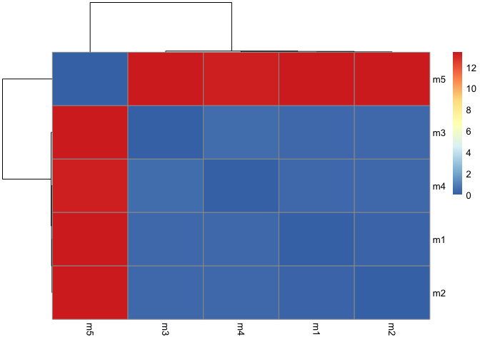

# Class 11: AlphaFold
Renee Zuhars (PID: A17329856)

- [Using AlphaFold](#using-alphafold)
  - [Plots](#plots)
    - [Heatmap](#heatmap)
    - [pLDDT values](#plddt-values)
    - [RMSF](#rmsf)
    - [Predicted Alignment Error for
      domains](#predicted-alignment-error-for-domains)
    - [Residue conservation from alignment
      file](#residue-conservation-from-alignment-file)

# Using AlphaFold

Here we read the results from AlphaFold and try to interpret all of the
models and quality score metrics:

``` r
library(bio3d)

pth <- "dimer_23119/"
pdb.files <- list.files(path = pth, full.names = TRUE, pattern = ".pdb")
```

Align and superimpose all these models:

``` r
file.exists(pdb.files)
```

    [1] TRUE TRUE TRUE TRUE TRUE

``` r
pdbs <- pdbaln(pdb.files, fit = TRUE, exefile = "msa")
```

    Reading PDB files:
    dimer_23119//dimer_23119_unrelaxed_rank_001_alphafold2_multimer_v3_model_2_seed_000.pdb
    dimer_23119//dimer_23119_unrelaxed_rank_002_alphafold2_multimer_v3_model_5_seed_000.pdb
    dimer_23119//dimer_23119_unrelaxed_rank_003_alphafold2_multimer_v3_model_4_seed_000.pdb
    dimer_23119//dimer_23119_unrelaxed_rank_004_alphafold2_multimer_v3_model_1_seed_000.pdb
    dimer_23119//dimer_23119_unrelaxed_rank_005_alphafold2_multimer_v3_model_3_seed_000.pdb
    .....

    Extracting sequences

    pdb/seq: 1   name: dimer_23119//dimer_23119_unrelaxed_rank_001_alphafold2_multimer_v3_model_2_seed_000.pdb 
    pdb/seq: 2   name: dimer_23119//dimer_23119_unrelaxed_rank_002_alphafold2_multimer_v3_model_5_seed_000.pdb 
    pdb/seq: 3   name: dimer_23119//dimer_23119_unrelaxed_rank_003_alphafold2_multimer_v3_model_4_seed_000.pdb 
    pdb/seq: 4   name: dimer_23119//dimer_23119_unrelaxed_rank_004_alphafold2_multimer_v3_model_1_seed_000.pdb 
    pdb/seq: 5   name: dimer_23119//dimer_23119_unrelaxed_rank_005_alphafold2_multimer_v3_model_3_seed_000.pdb 

RMSD is a standard measure of structural distance between coordinate
sets. We can use the rmsd() function to calculate the RMSD between all
pairs models.

``` r
rd <- rmsd(pdbs, fit=T)
```

    Warning in rmsd(pdbs, fit = T): No indices provided, using the 198 non NA positions

``` r
range(rd)
```

    [1]  0.000 13.406

## Plots

### Heatmap

Draw a heatmap of these RMSD matrix values.

``` r
library(pheatmap)

colnames(rd) <- paste0("m",1:5)
rownames(rd) <- paste0("m",1:5)
pheatmap(rd)
```



### pLDDT values

Now, let’s plot the pLDDT values across all models. Recall that this
information is in the B-factor column of each model and that this is
stored in our aligned pdbs object as pdbs\$b with a row per
structure/model.

``` r
# Read a reference PDB structure
pdb <- read.pdb("1hsg")
```

      Note: Accessing on-line PDB file

``` r
plot(pdbs$b[1,],typ="l", ylim=c(0,100))
lines(pdbs$b[2,],typ="l", col="navy")
lines(pdbs$b[3,],typ="l", col="chartreuse")
lines(pdbs$b[4,],typ="l", col="orange")
lines(pdbs$b[5,],typ="l", col="red")
```


We can improve the superposition/fitting of our models by finding the
most consistent “rigid core” common across all the models. For this we
will use the core.find() function:

``` r
core <- core.find(pdbs)
```

     core size 197 of 198  vol = 32.323 
     core size 196 of 198  vol = 28.916 
     core size 195 of 198  vol = 27.276 
     core size 194 of 198  vol = 25.733 
     core size 193 of 198  vol = 24.724 
     core size 192 of 198  vol = 23.805 
     core size 191 of 198  vol = 23.128 
     core size 190 of 198  vol = 22.502 
     core size 189 of 198  vol = 21.867 
     core size 188 of 198  vol = 21.293 
     core size 187 of 198  vol = 20.774 
     core size 186 of 198  vol = 20.305 
     core size 185 of 198  vol = 19.783 
     core size 184 of 198  vol = 19.353 
     core size 183 of 198  vol = 18.94 
     core size 182 of 198  vol = 18.539 
     core size 181 of 198  vol = 18.097 
     core size 180 of 198  vol = 17.694 
     core size 179 of 198  vol = 17.257 
     core size 178 of 198  vol = 16.867 
     core size 177 of 198  vol = 16.519 
     core size 176 of 198  vol = 16.237 
     core size 175 of 198  vol = 15.978 
     core size 174 of 198  vol = 15.693 
     core size 173 of 198  vol = 15.412 
     core size 172 of 198  vol = 15.174 
     core size 171 of 198  vol = 14.957 
     core size 170 of 198  vol = 14.733 
     core size 169 of 198  vol = 14.532 
     core size 168 of 198  vol = 14.363 
     core size 167 of 198  vol = 14.222 
     core size 166 of 198  vol = 13.981 
     core size 165 of 198  vol = 13.885 
     core size 164 of 198  vol = 13.822 
     core size 163 of 198  vol = 13.736 
     core size 162 of 198  vol = 13.646 
     core size 161 of 198  vol = 13.58 
     core size 160 of 198  vol = 13.46 
     core size 159 of 198  vol = 13.261 
     core size 158 of 198  vol = 13.076 
     core size 157 of 198  vol = 12.91 
     core size 156 of 198  vol = 12.971 
     core size 155 of 198  vol = 12.926 
     core size 154 of 198  vol = 12.892 
     core size 153 of 198  vol = 12.769 
     core size 152 of 198  vol = 12.648 
     core size 151 of 198  vol = 12.53 
     core size 150 of 198  vol = 12.326 
     core size 149 of 198  vol = 12.104 
     core size 148 of 198  vol = 11.905 
     core size 147 of 198  vol = 11.473 
     core size 146 of 198  vol = 11.155 
     core size 145 of 198  vol = 10.956 
     core size 144 of 198  vol = 10.755 
     core size 143 of 198  vol = 10.546 
     core size 142 of 198  vol = 10.276 
     core size 141 of 198  vol = 10.066 
     core size 140 of 198  vol = 9.835 
     core size 139 of 198  vol = 9.619 
     core size 138 of 198  vol = 9.405 
     core size 137 of 198  vol = 9.142 
     core size 136 of 198  vol = 8.863 
     core size 135 of 198  vol = 8.526 
     core size 134 of 198  vol = 8.229 
     core size 133 of 198  vol = 7.998 
     core size 132 of 198  vol = 7.809 
     core size 131 of 198  vol = 7.509 
     core size 130 of 198  vol = 7.288 
     core size 129 of 198  vol = 7.084 
     core size 128 of 198  vol = 6.88 
     core size 127 of 198  vol = 6.59 
     core size 126 of 198  vol = 6.38 
     core size 125 of 198  vol = 6.197 
     core size 124 of 198  vol = 5.976 
     core size 123 of 198  vol = 5.764 
     core size 122 of 198  vol = 5.568 
     core size 121 of 198  vol = 5.312 
     core size 120 of 198  vol = 5.021 
     core size 119 of 198  vol = 4.758 
     core size 118 of 198  vol = 4.501 
     core size 117 of 198  vol = 4.218 
     core size 116 of 198  vol = 4.031 
     core size 115 of 198  vol = 3.801 
     core size 114 of 198  vol = 3.604 
     core size 113 of 198  vol = 3.379 
     core size 112 of 198  vol = 3.183 
     core size 111 of 198  vol = 3.002 
     core size 110 of 198  vol = 2.79 
     core size 109 of 198  vol = 2.603 
     core size 108 of 198  vol = 2.508 
     core size 107 of 198  vol = 2.421 
     core size 106 of 198  vol = 2.24 
     core size 105 of 198  vol = 2.084 
     core size 104 of 198  vol = 1.945 
     core size 103 of 198  vol = 1.832 
     core size 102 of 198  vol = 1.659 
     core size 101 of 198  vol = 1.582 
     core size 100 of 198  vol = 1.483 
     core size 99 of 198  vol = 1.382 
     core size 98 of 198  vol = 1.331 
     core size 97 of 198  vol = 1.264 
     core size 96 of 198  vol = 1.137 
     core size 95 of 198  vol = 1.043 
     core size 94 of 198  vol = 0.957 
     core size 93 of 198  vol = 0.885 
     core size 92 of 198  vol = 0.803 
     core size 91 of 198  vol = 0.73 
     core size 90 of 198  vol = 0.637 
     core size 89 of 198  vol = 0.56 
     core size 88 of 198  vol = 0.489 
     FINISHED: Min vol ( 0.5 ) reached

``` r
core.inds <- print(core, vol=0.5)
```

    # 89 positions (cumulative volume <= 0.5 Angstrom^3) 
      start end length
    1    10  42     33
    2    44  50      7
    3    52  66     15
    4    69  77      9
    5    80  98     19

``` r
xyz <- pdbfit(pdbs, core.inds, outpath="corefit_structures")
```

### RMSF

Now we can examine the RMSF between positions of the structure. RMSF is
an often used measure of conformational variance along the structure:

``` r
rf <- rmsf(xyz)

plotb3(rf, sse=pdb)
abline(v=100, col="gray", ylab="RMSF")
```


### Predicted Alignment Error for domains

Independent of the 3D structure, AlphaFold produces an output called
Predicted Aligned Error (PAE). This is detailed in the JSON format
result files, one for each model structure.

``` r
library(jsonlite)

# Listing of all PAE JSON files
pae_files <- list.files(path=pth,
                        pattern=".*model.*\\.json",
                        full.names = TRUE)
```

Let’s read the first and fifth files:

``` r
pae1 <- read_json(pae_files[1],simplifyVector = TRUE)
pae2 <- read_json(pae_files[2],simplifyVector = TRUE)
pae3 <- read_json(pae_files[3],simplifyVector = TRUE)
pae4 <- read_json(pae_files[4],simplifyVector = TRUE)
pae5 <- read_json(pae_files[5],simplifyVector = TRUE)

attributes(pae1)
```

    $names
    [1] "plddt"   "max_pae" "pae"     "ptm"     "iptm"   

``` r
attributes(pae5)
```

    $names
    [1] "plddt"   "max_pae" "pae"     "ptm"     "iptm"   

``` r
# Per-residue pLDDT scores are the same as B-factor of PDB..
head(pae1$plddt) 
```

    [1] 91.44 96.06 97.38 97.38 98.19 96.94

``` r
head(pae5$plddt)
```

    [1] 18.77 21.09 25.69 27.73 32.16 34.03

When ranking models, the maximum PAE values are the most useful. A lower
score indicates a better model.

``` r
pae1$max_pae
```

    [1] 13.57812

``` r
pae2$max_pae
```

    [1] 15.71094

``` r
pae3$max_pae
```

    [1] 12.41406

``` r
pae4$max_pae
```

    [1] 19.95312

``` r
pae5$max_pae
```

    [1] 29.85938

Here, we can see that model 1 is much better than model 5, and that
model 5 is much worse than all the other models. Model 3 appears to be
the best.

We can plot the N by N (where N is the number of residues) PAE scores
with ggplot or with functions from the Bio3D package:

``` r
plot.dmat(pae1$pae, 
          xlab="Residue Position (i)",
          ylab="Residue Position (j)",
          grid.col = "black",
          zlim=c(0,30))
```


``` r
plot.dmat(pae3$pae, 
          xlab="Residue Position (i)",
          ylab="Residue Position (j)",
          grid.col = "black",
          zlim=c(0,30))
```


``` r
plot.dmat(pae5$pae, 
          xlab="Residue Position (i)",
          ylab="Residue Position (j)",
          grid.col = "black",
          zlim=c(0,30))
```


### Residue conservation from alignment file

``` r
aln_file <- list.files(path=pth,
                       pattern=".a3m$",
                        full.names = TRUE)
aln_file
```

    [1] "dimer_23119//dimer_23119.a3m"

``` r
aln <- read.fasta(aln_file[1], to.upper = TRUE)
```

    [1] " ** Duplicated sequence id's: 101 **"
    [2] " ** Duplicated sequence id's: 101 **"

``` r
dim(aln$ali) #How many sequences are in this alignment
```

    [1] 5378  132

``` r
# We can score residue conservation in the alignment with the conserv() function.
sim <- conserv(aln)

plotb3(sim[1:99], sse=trim.pdb(pdb, chain="A"),
       ylab="Conservation Score")
```


The conserved positions will stand out more if we generate a consensus
sequence with a high cutoff value:

``` r
con <- consensus(aln, cutoff = 0.9)
con$seq
```

      [1] "-" "-" "-" "-" "-" "-" "-" "-" "-" "-" "-" "-" "-" "-" "-" "-" "-" "-"
     [19] "-" "-" "-" "-" "-" "-" "D" "T" "G" "A" "-" "-" "-" "-" "-" "-" "-" "-"
     [37] "-" "-" "-" "-" "-" "-" "-" "-" "-" "-" "-" "-" "-" "-" "-" "-" "-" "-"
     [55] "-" "-" "-" "-" "-" "-" "-" "-" "-" "-" "-" "-" "-" "-" "-" "-" "-" "-"
     [73] "-" "-" "-" "-" "-" "-" "-" "-" "-" "-" "-" "-" "-" "-" "-" "-" "-" "-"
     [91] "-" "-" "-" "-" "-" "-" "-" "-" "-" "-" "-" "-" "-" "-" "-" "-" "-" "-"
    [109] "-" "-" "-" "-" "-" "-" "-" "-" "-" "-" "-" "-" "-" "-" "-" "-" "-" "-"
    [127] "-" "-" "-" "-" "-" "-"

For a final visualization of these functionally important sites we can
map this conservation score to the Occupancy column of a PDB file for
viewing in molecular viewer programs such as Mol\*, PyMol, VMD, chimera
etc.

``` r
m1.pdb <- read.pdb(pdb.files[1])
occ <- vec2resno(c(sim[1:99], sim[1:99]), m1.pdb$atom$resno)
write.pdb(m1.pdb, o=occ, file="m1_conserv.pdb")
```
