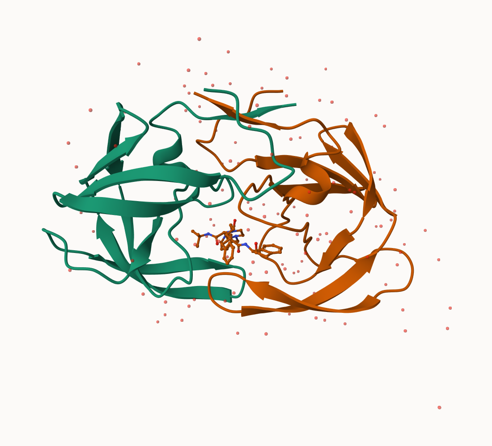

# Class 10- Structural Bioinformatics (pt 1)
Renee Zuhars- PID: A17329856

- [The PDB Database](#the-pdb-database)
  - [Question 1](#question-1)
  - [Question 2](#question-2)
  - [Question 3](#question-3)
- [Visualizing with Mol-star](#visualizing-with-mol-star)
  - [Question 4](#question-4)
  - [Question 5](#question-5)
  - [Question 6](#question-6)
- [Using the bio3d prackage in R](#using-the-bio3d-prackage-in-r)
  - [Question 7](#question-7)
  - [Question 8](#question-8)
  - [Question 9](#question-9)
- [Predicting functional motions of a single
  structure](#predicting-functional-motions-of-a-single-structure)

sequence: unfolded chain of AA chain, highly mobile, inactive.

structure: ordered in precise 3D arrangement, stable but dynamic.

function: active in specific “conformations”.

# The PDB Database

The main repository of biomolecular structure data is called the
[Protein Data Bank](https://www.rcsb.org) (PDB for short). It is the
second oldest database (after GenBank).

What is currently in the PDB? We can access current composition stats
[here](https://www.rcsb.org/stats)

``` r
stats <- read.csv("pdb.dist.by.exp.method.csv", row.names = 1)
stats
```

                              X.ray     EM    NMR Multiple.methods Neutron Other
    Protein (only)          171,959 18,083 12,622              210      84    32
    Protein/Oligosaccharide  10,018  2,968     34               10       2     0
    Protein/NA                8,847  5,376    286                7       0     0
    Nucleic acid (only)       2,947    185  1,535               14       3     1
    Other                       170     10     33                0       0     0
    Oligosaccharide (only)       11      0      6                1       0     4
                              Total
    Protein (only)          202,990
    Protein/Oligosaccharide  13,032
    Protein/NA               14,516
    Nucleic acid (only)       4,685
    Other                       213
    Oligosaccharide (only)       22

### Question 1

> What percentage of structures in the PDB are solved by X-Ray and
> Electron Microscopy?

``` r
#substitute commas for nothing in values with commas
stats$X.ray <- gsub(",", "", stats$X.ray) 

#converts characters to numbers
y <- as.numeric(stats$X.ray) 

#sum
sum(y)
```

    [1] 193952

I am going to turn this snippet into a function so I can use it any time
I have this comma problem.

``` r
comma.sum <- function(x) {
  y <- gsub (",", "",x)
  return(sum(as.numeric(y)))
}
```

``` r
xray.sum <- comma.sum(stats$X.ray)
em.sum <- comma.sum(stats$EM)
total.sum <- comma.sum(stats$Total)

xray.sum/total.sum * 100
```

    [1] 82.37223

``` r
em.sum/total.sum * 100
```

    [1] 11.30648

82 percent of structures have been solved with X-ray, and 11 percent of
functions have been solved by Electron Microscopy, making a total of 93
percent of protein structures solved by both methods.

### Question 2

> What proportion of structures in the PDB are protein (only)?

``` r
comma.sum(stats["Protein (only)","Total"]) / comma.sum(stats[,"Total"])
```

    [1] 0.862107

86% of structures in the PDB are protein only.

### Question 3

> skipped

# Visualizing with Mol-star

Explore the HIV-1 protease structure with PDB code `1HSG` Mol-star
homepage: https://molstar.org/viewer/



### Question 4

> Water molecules normally have 3 atoms. Why do we see just one atom per
> water molecule in this structure?

We just see one atom per water because it is the simplest way for
MolStar to render the water molecules, as there are a lot of them. Below
is a figure where the water molecules are removed:


### Question 5

> There is a critical “conserved” water molecule in the binding site.
> Can you identify this water molecule? What residue number does this
> water molecule have?

This critical “conserved” water molecule is HOH 308.

### Question 6

> Generate and save a figure clearly showing the two distinct chains of
> HIV-protease along with the ligand. You might also consider showing
> the catalytic residues ASP 25 in each chain and the critical water.


# Using the bio3d prackage in R

The Bio3D package is focused on structural bioinformatics analysis and
allows us to read and analyze PDB (and related) data.

``` r
library(bio3d)

pdb <- read.pdb("1hsg")
```

      Note: Accessing on-line PDB file

``` r
pdb
```


     Call:  read.pdb(file = "1hsg")

       Total Models#: 1
         Total Atoms#: 1686,  XYZs#: 5058  Chains#: 2  (values: A B)

         Protein Atoms#: 1514  (residues/Calpha atoms#: 198)
         Nucleic acid Atoms#: 0  (residues/phosphate atoms#: 0)

         Non-protein/nucleic Atoms#: 172  (residues: 128)
         Non-protein/nucleic resid values: [ HOH (127), MK1 (1) ]

       Protein sequence:
          PQITLWQRPLVTIKIGGQLKEALLDTGADDTVLEEMSLPGRWKPKMIGGIGGFIKVRQYD
          QILIEICGHKAIGTVLVGPTPVNIIGRNLLTQIGCTLNFPQITLWQRPLVTIKIGGQLKE
          ALLDTGADDTVLEEMSLPGRWKPKMIGGIGGFIKVRQYDQILIEICGHKAIGTVLVGPTP
          VNIIGRNLLTQIGCTLNF

    + attr: atom, xyz, seqres, helix, sheet,
            calpha, remark, call

we can see atom data with `pdb$atom`

``` r
head (pdb$atom)
```

      type eleno elety  alt resid chain resno insert      x      y     z o     b
    1 ATOM     1     N <NA>   PRO     A     1   <NA> 29.361 39.686 5.862 1 38.10
    2 ATOM     2    CA <NA>   PRO     A     1   <NA> 30.307 38.663 5.319 1 40.62
    3 ATOM     3     C <NA>   PRO     A     1   <NA> 29.760 38.071 4.022 1 42.64
    4 ATOM     4     O <NA>   PRO     A     1   <NA> 28.600 38.302 3.676 1 43.40
    5 ATOM     5    CB <NA>   PRO     A     1   <NA> 30.508 37.541 6.342 1 37.87
    6 ATOM     6    CG <NA>   PRO     A     1   <NA> 29.296 37.591 7.162 1 38.40
      segid elesy charge
    1  <NA>     N   <NA>
    2  <NA>     C   <NA>
    3  <NA>     C   <NA>
    4  <NA>     O   <NA>
    5  <NA>     C   <NA>
    6  <NA>     C   <NA>

### Question 7

> How many amino acid residues are there in this pdb object?

198 amino acid residues.

### Question 8

> Name one of the two non-protein residues?

HOH (127)

### Question 9

> How many protein chains are in this structure?

2 protein chains.

now let’s look at protein sequence.

``` r
head(pdbseq(pdb))
```

      1   2   3   4   5   6 
    "P" "Q" "I" "T" "L" "W" 

We can make quick 3d viz with the `view.pdb()`

``` r
# library(bio3dview)
# library(NGLVieweR)
# view.pdb(pdb, backgroundColor = "black", colorScheme = "sse")
```

``` r
# sel <- atom.select(pdb, resno = 25)

# view.pdb(pdb, cols=c("turquoise", "pink"),
      #  highlight = sel,
      #  highlight.style = "spacefill")
```

# Predicting functional motions of a single structure

We can finish off today with a bioinformatics prediction of the
functional motions of a protein.

We will run a Normal Mode Analysis (NMA)

``` r
adk <- read.pdb("6s36")
```

      Note: Accessing on-line PDB file
       PDB has ALT records, taking A only, rm.alt=TRUE

``` r
adk
```


     Call:  read.pdb(file = "6s36")

       Total Models#: 1
         Total Atoms#: 1898,  XYZs#: 5694  Chains#: 1  (values: A)

         Protein Atoms#: 1654  (residues/Calpha atoms#: 214)
         Nucleic acid Atoms#: 0  (residues/phosphate atoms#: 0)

         Non-protein/nucleic Atoms#: 244  (residues: 244)
         Non-protein/nucleic resid values: [ CL (3), HOH (238), MG (2), NA (1) ]

       Protein sequence:
          MRIILLGAPGAGKGTQAQFIMEKYGIPQISTGDMLRAAVKSGSELGKQAKDIMDAGKLVT
          DELVIALVKERIAQEDCRNGFLLDGFPRTIPQADAMKEAGINVDYVLEFDVPDELIVDKI
          VGRRVHAPSGRVYHVKFNPPKVEGKDDVTGEELTTRKDDQEETVRKRLVEYHQMTAPLIG
          YYSKEAEAGNTKYAKVDGTKPVAEVRADLEKILG

    + attr: atom, xyz, seqres, helix, sheet,
            calpha, remark, call

``` r
m <- nma(adk)
```

     Building Hessian...        Done in 0.013 seconds.
     Diagonalizing Hessian...   Done in 0.302 seconds.

``` r
plot(m)
```


``` r
# view.nma(m)
```

We can write out a trajectory of the predicted dynamics and view this in
Mol-Star

``` r
mktrj(m, file = "nma.pdb")
```
