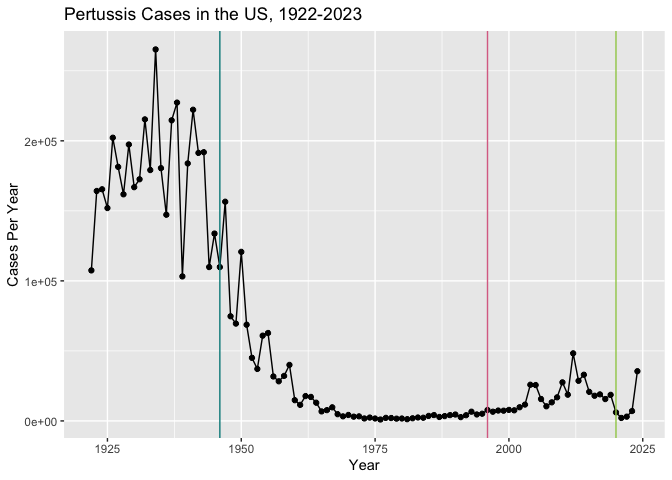
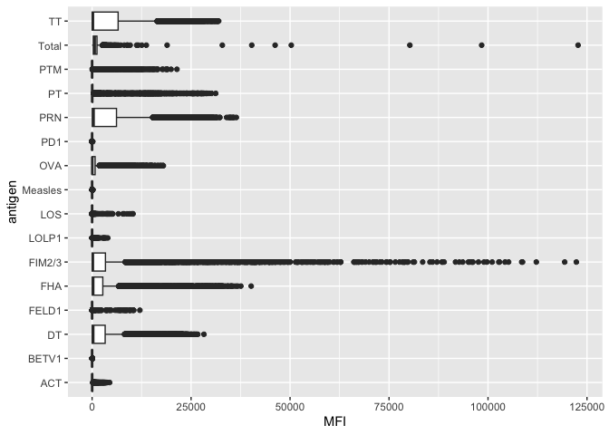
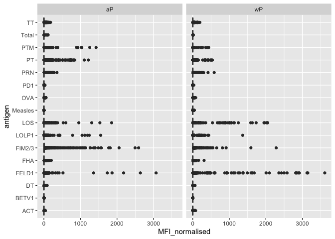
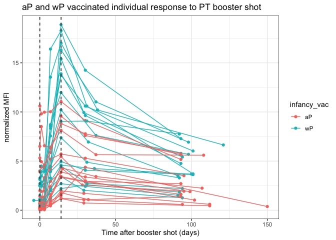

# Class 18- Pertussis Mini Project
Renee Zuhars (PID: A17329856)

- [Background](#background)
- [Examining Cases of Pertussis by
  year](#examining-cases-of-pertussis-by-year)
  - [Question 1](#question-1)
  - [Question 2](#question-2)
- [Enter the CMI-PB project](#enter-the-cmi-pb-project)
  - [Question 3](#question-3)
  - [Question 4](#question-4)
  - [Question 5](#question-5)
  - [Question 6](#question-6)
  - [Question 7](#question-7)
  - [Question 8](#question-8)
  - [Question 9](#question-9)
  - [Question 10](#question-10)
  - [Question 11](#question-11)

# Background

Pertussis (aka whooping cough) is a common lung infection caused by the
bacteria *B. Pertussis*.

The CDC tracks cases of Pertussis in the US:
https://www.cdc.gov/pertussis/php/surveillance/pertussis-cases-by-year.html

# Examining Cases of Pertussis by year

We can use the **datapasta** package to scrape case numbers from the CDC
website.

### Question 1

> Make a plot of Pertussis cases per year using ggplot.

``` r
library(ggplot2)

cases <- 
ggplot(cdc) +
  aes(x=year, y=cases) +
  geom_point() +
  geom_line() +
  labs(x= "Year", y= "Cases Per Year", title= "Pertussis Cases in the US, 1922-2023")
```

### Question 2

> Add some key time points in our history of interaction with Pertussis
> to our plot. These include wP rollout (the first vaccine) in 1946 and
> the switch to aP in 1996.

We can use `geom_vline()` for this.

``` r
cases +
  geom_vline(xintercept = 1946, col="darkcyan") +
  geom_vline(xintercept = 1996, col="palevioletred") +
  geom_vline(xintercept = 2020, col="darkolivegreen3")
```



After the wP vaccine (blue line), case numbers decreased, indicating a
successful regression of the virus.

However, after the aP virus, we can see a small rise in case numbers.
This number declines in 2020 due to the lockdown, but we can see it rise
again as we came out of COVID in 2024.

Mounting evidence suggests that the newer **aP** vaccine is less
effective over the long term than the older **wP** vaccine that it
replaced. The immune protection provided by the aP vaccine looks like it
doesn’t last as long as the wP vaccine. So, booster shots of the aP
vaccine are recommended.

# Enter the CMI-PB project

CMI-PB (Computational Models of Immunity - Pertussis boost) major goal
is to investigate how the immune system responds differently in aP
versus wP vaccinated individuals. It also aims to predict this at an
early stage.

CMI-PB makes all their collected data freely available and they store it
in a database composed of different tables. Here we will access a few of
these.

We can use the **jsonlite** package to read this data.

``` r
library(jsonlite)

subject <- read_json("https://www.cmi-pb.org/api/v5_1/subject", simplifyVector = TRUE)

head(subject, 4)
```

      subject_id infancy_vac biological_sex              ethnicity  race
    1          1          wP         Female Not Hispanic or Latino White
    2          2          wP         Female Not Hispanic or Latino White
    3          3          wP         Female                Unknown White
    4          4          wP           Male Not Hispanic or Latino Asian
      year_of_birth date_of_boost      dataset
    1    1986-01-01    2016-09-12 2020_dataset
    2    1968-01-01    2019-01-28 2020_dataset
    3    1983-01-01    2016-10-10 2020_dataset
    4    1988-01-01    2016-08-29 2020_dataset

### Question 3

> How many subjects (i.e. enrolled people) are there in this dataset?

``` r
nrow(subject)
```

    [1] 172

There are 172 subjects in this dataset.

### Question 4

> How many “aP” and “wP” subjects are there?

``` r
table(subject$infancy_vac)
```


    aP wP 
    87 85 

There are 87 aP subjects and 85 wP subjects.

### Question 5

> How many Male/Female participants are in the dataset?

``` r
table(subject$biological_sex)
```


    Female   Male 
       112     60 

There are 112 female participants and 60 male participants.

### Question 6

> How about gender AND race numbers?

``` r
table(subject$race, subject$biological_sex)
```

                                               
                                                Female Male
      American Indian/Alaska Native                  0    1
      Asian                                         32   12
      Black or African American                      2    3
      More Than One Race                            15    4
      Native Hawaiian or Other Pacific Islander      1    1
      Unknown or Not Reported                       14    7
      White                                         48   32

### Question 7

> Is this representative of the US demographics?

Absolutely not. It represents UCSD’s student population pretty well,
though.

Let’s read another database table (or two) from CMI-PB:

``` r
specimen <- read_json("https://www.cmi-pb.org/api/v5_1/specimen", simplifyVector = TRUE)

ab_data <- read_json("https://www.cmi-pb.org/api/v5_1/plasma_ab_titer", simplifyVector = TRUE)
```

Wee peek at these:

``` r
head(specimen)
```

      specimen_id subject_id actual_day_relative_to_boost
    1           1          1                           -3
    2           2          1                            1
    3           3          1                            3
    4           4          1                            7
    5           5          1                           11
    6           6          1                           32
      planned_day_relative_to_boost specimen_type visit
    1                             0         Blood     1
    2                             1         Blood     2
    3                             3         Blood     3
    4                             7         Blood     4
    5                            14         Blood     5
    6                            30         Blood     6

We want to “join” these tables to get all our information together. For
this we will use the **dplyr** package and the `inner_join()` function.

``` r
library(dplyr)
```


    Attaching package: 'dplyr'

    The following objects are masked from 'package:stats':

        filter, lag

    The following objects are masked from 'package:base':

        intersect, setdiff, setequal, union

``` r
meta <- inner_join(subject, specimen)
```

    Joining with `by = join_by(subject_id)`

``` r
head(meta)
```

      subject_id infancy_vac biological_sex              ethnicity  race
    1          1          wP         Female Not Hispanic or Latino White
    2          1          wP         Female Not Hispanic or Latino White
    3          1          wP         Female Not Hispanic or Latino White
    4          1          wP         Female Not Hispanic or Latino White
    5          1          wP         Female Not Hispanic or Latino White
    6          1          wP         Female Not Hispanic or Latino White
      year_of_birth date_of_boost      dataset specimen_id
    1    1986-01-01    2016-09-12 2020_dataset           1
    2    1986-01-01    2016-09-12 2020_dataset           2
    3    1986-01-01    2016-09-12 2020_dataset           3
    4    1986-01-01    2016-09-12 2020_dataset           4
    5    1986-01-01    2016-09-12 2020_dataset           5
    6    1986-01-01    2016-09-12 2020_dataset           6
      actual_day_relative_to_boost planned_day_relative_to_boost specimen_type
    1                           -3                             0         Blood
    2                            1                             1         Blood
    3                            3                             3         Blood
    4                            7                             7         Blood
    5                           11                            14         Blood
    6                           32                            30         Blood
      visit
    1     1
    2     2
    3     3
    4     4
    5     5
    6     6

``` r
head(ab_data)
```

      specimen_id isotype is_antigen_specific antigen        MFI MFI_normalised
    1           1     IgE               FALSE   Total 1110.21154       2.493425
    2           1     IgE               FALSE   Total 2708.91616       2.493425
    3           1     IgG                TRUE      PT   68.56614       3.736992
    4           1     IgG                TRUE     PRN  332.12718       2.602350
    5           1     IgG                TRUE     FHA 1887.12263      34.050956
    6           1     IgE                TRUE     ACT    0.10000       1.000000
       unit lower_limit_of_detection
    1 UG/ML                 2.096133
    2 IU/ML                29.170000
    3 IU/ML                 0.530000
    4 IU/ML                 6.205949
    5 IU/ML                 4.679535
    6 IU/ML                 2.816431

One more “join” to get ab_data and meta all together.

``` r
abdata <- inner_join(ab_data, meta)
```

    Joining with `by = join_by(specimen_id)`

``` r
head(abdata)
```

      specimen_id isotype is_antigen_specific antigen        MFI MFI_normalised
    1           1     IgE               FALSE   Total 1110.21154       2.493425
    2           1     IgE               FALSE   Total 2708.91616       2.493425
    3           1     IgG                TRUE      PT   68.56614       3.736992
    4           1     IgG                TRUE     PRN  332.12718       2.602350
    5           1     IgG                TRUE     FHA 1887.12263      34.050956
    6           1     IgE                TRUE     ACT    0.10000       1.000000
       unit lower_limit_of_detection subject_id infancy_vac biological_sex
    1 UG/ML                 2.096133          1          wP         Female
    2 IU/ML                29.170000          1          wP         Female
    3 IU/ML                 0.530000          1          wP         Female
    4 IU/ML                 6.205949          1          wP         Female
    5 IU/ML                 4.679535          1          wP         Female
    6 IU/ML                 2.816431          1          wP         Female
                   ethnicity  race year_of_birth date_of_boost      dataset
    1 Not Hispanic or Latino White    1986-01-01    2016-09-12 2020_dataset
    2 Not Hispanic or Latino White    1986-01-01    2016-09-12 2020_dataset
    3 Not Hispanic or Latino White    1986-01-01    2016-09-12 2020_dataset
    4 Not Hispanic or Latino White    1986-01-01    2016-09-12 2020_dataset
    5 Not Hispanic or Latino White    1986-01-01    2016-09-12 2020_dataset
    6 Not Hispanic or Latino White    1986-01-01    2016-09-12 2020_dataset
      actual_day_relative_to_boost planned_day_relative_to_boost specimen_type
    1                           -3                             0         Blood
    2                           -3                             0         Blood
    3                           -3                             0         Blood
    4                           -3                             0         Blood
    5                           -3                             0         Blood
    6                           -3                             0         Blood
      visit
    1     1
    2     1
    3     1
    4     1
    5     1
    6     1

``` r
dim(abdata)
```

    [1] 61956    20

### Question 8

> How many antibody isotypes are there in the dataset?

``` r
table(abdata$isotype)
```


      IgE   IgG  IgG1  IgG2  IgG3  IgG4 
     6698  7265 11993 12000 12000 12000 

### Question 9

> How many different antigens are measured in the dataset?

``` r
table(abdata$antigen)
```


        ACT   BETV1      DT   FELD1     FHA  FIM2/3   LOLP1     LOS Measles     OVA 
       1970    1970    6318    1970    6712    6318    1970    1970    1970    6318 
        PD1     PRN      PT     PTM   Total      TT 
       1970    6712    6712    1970     788    6318 

### Question 10

> Make a box plot of antigen levels across the whole dataset, using MFI
> vs antigen.

``` r
ggplot(abdata) +
  aes(x = MFI, y = antigen) +
  geom_boxplot()
```

    Warning: Removed 1 row containing non-finite outside the scale range
    (`stat_boxplot()`).



### Question 11

> Are there obvious differences between aP and wP values?

``` r
ggplot(abdata) +
  aes(x = MFI_normalised, y = antigen) +
  geom_boxplot() +
  facet_wrap(~infancy_vac)
```



``` r
igg <- abdata |> filter(isotype == "IgG")

head(igg)
```

      specimen_id isotype is_antigen_specific antigen        MFI MFI_normalised
    1           1     IgG                TRUE      PT   68.56614       3.736992
    2           1     IgG                TRUE     PRN  332.12718       2.602350
    3           1     IgG                TRUE     FHA 1887.12263      34.050956
    4          19     IgG                TRUE      PT   20.11607       1.096366
    5          19     IgG                TRUE     PRN  976.67419       7.652635
    6          19     IgG                TRUE     FHA   60.76626       1.096457
       unit lower_limit_of_detection subject_id infancy_vac biological_sex
    1 IU/ML                 0.530000          1          wP         Female
    2 IU/ML                 6.205949          1          wP         Female
    3 IU/ML                 4.679535          1          wP         Female
    4 IU/ML                 0.530000          3          wP         Female
    5 IU/ML                 6.205949          3          wP         Female
    6 IU/ML                 4.679535          3          wP         Female
                   ethnicity  race year_of_birth date_of_boost      dataset
    1 Not Hispanic or Latino White    1986-01-01    2016-09-12 2020_dataset
    2 Not Hispanic or Latino White    1986-01-01    2016-09-12 2020_dataset
    3 Not Hispanic or Latino White    1986-01-01    2016-09-12 2020_dataset
    4                Unknown White    1983-01-01    2016-10-10 2020_dataset
    5                Unknown White    1983-01-01    2016-10-10 2020_dataset
    6                Unknown White    1983-01-01    2016-10-10 2020_dataset
      actual_day_relative_to_boost planned_day_relative_to_boost specimen_type
    1                           -3                             0         Blood
    2                           -3                             0         Blood
    3                           -3                             0         Blood
    4                           -3                             0         Blood
    5                           -3                             0         Blood
    6                           -3                             0         Blood
      visit
    1     1
    2     1
    3     1
    4     1
    5     1
    6     1

Same boxplot of antigens as before:

``` r
ggplot(igg) +
  aes(x = MFI_normalised, y = antigen, col=infancy_vac) +
  geom_boxplot() +
  facet_wrap(~visit)
```


Focus in further on just one of these antigens - let’s pick **PT**
(Pertussis Toxin, one of the main toxins of the bacteria) in the
**2021_dataset** again for **IgG** antibody isotopes.

``` r
table(igg$dataset)
```


    2020_dataset 2021_dataset 2022_dataset 2023_dataset 
            1182         1617         1456         3010 

``` r
pt_igg <- abdata |> 
  filter(isotype=="IgG", 
         antigen=="PT", 
         dataset=="2021_dataset")

dim(pt_igg)
```

    [1] 231  20

``` r
ggplot(pt_igg) +
  aes(actual_day_relative_to_boost, 
      MFI_normalised, 
      col=infancy_vac,
      group=subject_id) +
  geom_point() +
  geom_line() +
  theme_bw() +
  geom_vline(xintercept = 0, linetype = "dashed") +
  geom_vline(xintercept = 14, linetype = "dashed") +
  labs(title = "aP and wP vaccinated individual response to PT booster shot", x = "Time after booster shot (days)", y = "normalized MFI")
```


